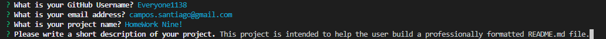
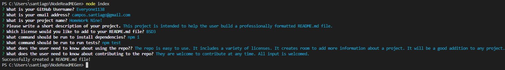
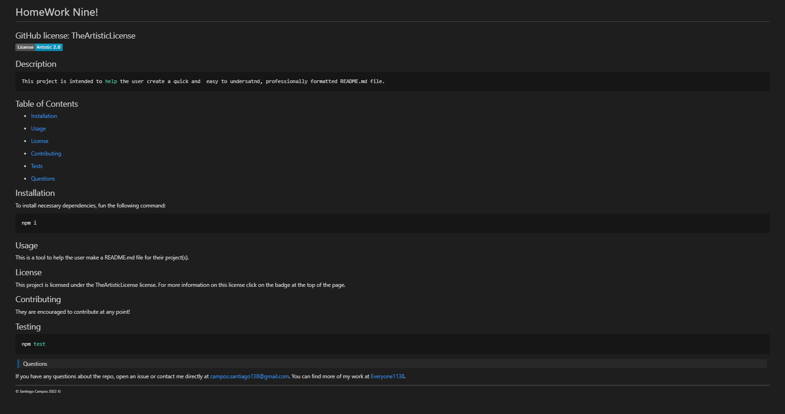

# README.md Generator!

## Welcome to the README file for my README.md generator. Below is all the information needed to fully understand this application.
---

##### *WARNING! When executing this application the README.md file will populate in place of this README. a copy of this is saved in a text file in the lib folder. If you wish to preview an example of the type of README.md file this application produces without executing the program visit the sampleREADME folder.*

## Table of Contents

* [Description](#description)

* [Usage](#usage)

* [WalkThrough-Video](#walkthrough-video)

* [License](#license)

* [Criteria](#criteria)

* [Future](#future)

* [Questions](#questions)

## Description

This application is meant for a user to make a README.md file for their project(s). The file is professionally formated and easy to read. The 'usage' section is filled with instructions and images to better guide the user on how the application works. Below the 'usage' section is a 'walkthrough video' section with a link to a video to better assist the user. The application can be used through a terminal as long as the user has [node.js](https://nodejs.org/en/download/) installed. The LTS vesion is recommended. 

In this README is also included sections that further elaborate on licenses, acceptance criteria, future improments, and a questions section that has my email and github for further inquiriess

---

## Usage

Here is a brief description of how to use the application with images showing how the questions appear in the terminal and how it populates in a README.md file. Before using this application the user must make sure to have node.js installed. If not, a link is provided in the description section. 

---

First; the user needs to open the index.js file in an intigrated terminal. In the terminal the user will then type in 'node index.js' and hit the enter key to activate a series of questions.
 
.png)

---

The first question asks the user what their GitHub username is. This entry will populate at the bottom of the page with a functional link to the users GitHub. The second second question will ask the user for their email. if the email is valid it will appear as a clickable link in the 'questions' section. The third question asks for the project title. The users entry in this field will populate at the top of the README.md file. The fourth question asks the user for a description of their project. This entry will populate in the 'description' section.  

---

The fifth question asks the user what license/badge they would like for their README.md file.The license choosen by the user will populate at the top of their README.md file in form of a badge that doubles as a clickable link for more information on the license. This is what the drop down menu looks like for the user to select the licesne that better fits their projects needs. 

##### *The section titled 'licenses' in this README.md file has links intended for the reader/user to better understand the complexities of the licenses the user can use/add to their README.md file*

---

After choosing a license the user is presented with sixth question. This question inquires about the the command needed to install dependancies. The users input will be populated in the installation section. The seventh question asks the user to to input the command on how to run tests.The users input will be populated in the testing section. The eighth question asks the user what needs to be known about their repo. The users input will populate in the usage section. The nineth questions asks the user what needs to be known about the contributions to their repo. The users input will populate in the contributing section. 

---

This is a final view of what the README.md file looks like with the users input in the specified fields.  

---

## Walkthrough Video

https://drive.google.com/file/d/1ynqmsgBr96TkjzTO6CgMWRK00dej4vML/view

---

## License
---
Below is a list of the badges/licesnes that the user can add to their README.md file. Each badge is clickable and will take the user to the corresponing link/information needed to better understand the legal parameters they function under. It is important to to review this type of information for future projects and to know which one to use. Familiarizing oneself with these can help avoid legal battles in the future. Formatting of these badges and links were provided by [Lukas-h](https://gist.github.com/lukas-h/2a5d00690736b4c3a7ba) .

* 

* 

* 

* 

* 

* 

* 

* 

---

## Criteria

---

This project fullfills all criteria. The code creates a README.md file. The applications asks all of the questions required and populates the users input in the appropriate sections. All the required dependencies were installed. Including the package.json and inquirer package. A video is included to help the user better understand how the application works. A series of screenshots and instructions are included to further help the user activate and use the application. The files that have the code in them have notes on how the code works. A sample read me is provided. A gitignore file is present to ignore modules. A package.json file is present to identify dependencies used.A text file has the hard code for this README in case it is written over. 

---

## Future

---

The first thing I would add to this application is an inquirer-date-prompt so that the user can add a time stamp of sorts to their README.md file.I would add more licenses. I would also format it similarly to how this README.md file is formatted. More space for images, gif's,video links, and other fields to atriculate the purpose and flexibitlity of the users project.  

---

## Questions

>Contact infromation:

If you have any questions about the repo, open an issue or contact me directly at campos.santiago138@gmail.com. You can find
more of my work at [my GitHub](https://github.com/Everyone1138).

---

###### ©️ Santiago Campos 2022 ©️
